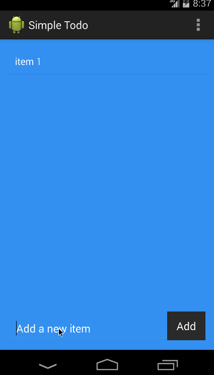

# CodePathToDo

CodePath Pre-work - To Do List Application

Time spent: 4 hours spent in total

Completed user stories:

* [x] Required: User can add an item to the list
* [x] Required: User can delete an item from the list by long clicking an item
* [x] Required: User can edit an item in the list by clicking an item
* [x] Required: User can save an edited item to the list
* [x] Optional: Updated Styling
* [x] Optional: Used Dialog Fragment in favor of Edit Item Activity

Walkthrough of all user stories:

